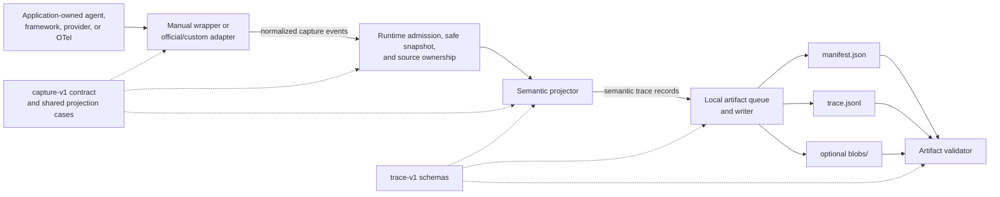

# Repository architecture

Maintainers and coding agents use this page to place changes in the current SDK.
It maps module ownership, data flow, TypeScript/Python correspondence, and the
smallest useful verification commands. It does not replace the behavior
contracts linked from the [SDK documentation index](../sdk/index.md).

## Architecture at a glance



The capture runtime owns source lifecycle, admission, correlation, loss
accounting, and projection behind one small interface. Artifact modules own
persistence, and each adapter owns details for its provider or framework.

Adjacent modules keep transport and host concerns outside the capture runtime:

| Module | Owns | Must not own |
|---|---|---|
| OpenClaw adapter | Host hooks and exact native normalization | Cloud protocol or storage |
| Capture runtime | Projection, credential scrubbing, and local sealing | Network upload |
| Cloud uploader | Bundle validation, durable spooling, and exact-byte transport | Trace interpretation |
| Ingest receiver | Authentication, admission, canonical validation, write-once object creation, and completion receipts | Agent or framework semantics |
| Trace CLI | Read only completed-bundle discovery, private local sync, and safe summaries | Upload, deletion, keys, or incomplete ingest state |
| GCP infrastructure | Deployment wiring, IAM, alerts, and enforced platform configuration | Application behavior |

Use this page to place capture changes. The [ingest contract](../../contracts/ingest/v1/README.md)
defines cloud transport. The [deployment guide](cloud/deployment.md) and
[operations guide](cloud/operations.md) describe hosted infrastructure work.

## Dependency direction

```text
contracts
  -> generated and packaged schema copies
  -> runtimes and semantic projectors
  -> provider, framework, custom, and OTel adapters
  -> sealed local trace bundles
  -> artifact validation

docs/sdk
  -> adopter instrumentation
```

Each module has one direction of responsibility:

- Adapters normalize native evidence but do not write files.
- Projectors consume normalized capture events but do not parse framework
  payloads.
- Artifact writers persist projected records but do not infer agent semantics.
- Validators inspect sealed artifacts but do not repair or reinterpret them.

## Module and seam ownership

| Module or seam | TypeScript owner | Python owner | Maintainer rule |
|---|---|---|---|
| Public package interface | [`packages/sdk/src/index.ts`](../../packages/sdk/src/index.ts) | [`semantic_layer/__init__.py`](../../packages/python/semantic_layer/__init__.py) | Keep the common path centered on `initialize` or TypeScript `createCapture`, adapters or custom sources, capture lifecycle, and validation. |
| Manual capture and runtime lifecycle | [`v1/runtime.ts`](../../packages/sdk/src/v1/runtime.ts) | [`capture_v1.py`](../../packages/python/semantic_layer/capture_v1.py) | Preserve application return, exception, cancellation, stream, and tool behavior. |
| Source interface | `CaptureSource`, `SourceSink`, and `SourceLifecycle` in [`v1/types.ts`](../../packages/sdk/src/v1/types.ts) | `CaptureSource` and runtime-owned admission in [`capture_v1.py`](../../packages/python/semantic_layer/capture_v1.py) | A source translates evidence at its native seam and supplies exact native identity. The runtime issues SDK identity, owns admission and teardown, and routes accepted records to the artifact. |
| Source ownership | [`v1/source-ownership.ts`](../../packages/sdk/src/v1/source-ownership.ts) | Coverage registry in [`capture_v1.py`](../../packages/python/semantic_layer/capture_v1.py) | The registry detects and finalizes owner and evidence overlap. It does not remove records. Adapters and the projector must keep evidence overlap from becoming a second semantic operation. |
| Semantic projection | [`trace/semantic-projector.ts`](../../packages/sdk/src/trace/semantic-projector.ts) | [`trace/projector.py`](../../packages/python/semantic_layer/trace/projector.py) | Keep framework branches out. Shared meaning belongs in the cross-runtime case corpus. |
| Artifact writing and recovery | [`v1/artifact.ts`](../../packages/sdk/src/v1/artifact.ts) | `_Artifact` in [`capture_v1.py`](../../packages/python/semantic_layer/capture_v1.py) | Write only `manifest.json`, `trace.jsonl`, and optional useful blobs. Relations and losses remain trace records. |
| Safe evidence, privacy, and permissions | [`v1/error-evidence.ts`](../../packages/sdk/src/v1/error-evidence.ts), [`adapters/native-snapshot.ts`](../../packages/sdk/src/adapters/native-snapshot.ts), [`v1/secret-scanner.ts`](../../packages/sdk/src/v1/secret-scanner.ts), and [`v1/permissions.ts`](../../packages/sdk/src/v1/permissions.ts) | [`_adapter_native.py`](../../packages/python/semantic_layer/_adapter_native.py), scanner and safe serialization in [`capture_v1.py`](../../packages/python/semantic_layer/capture_v1.py), and [`permissions.py`](../../packages/python/semantic_layer/permissions.py) | Avoid hostile getters, keep native evidence bounded, scan final files, and preserve owner-only bundle permissions. |
| Artifact validation | [`v1/validation.ts`](../../packages/sdk/src/v1/validation.ts) | [`validation.py`](../../packages/python/semantic_layer/validation.py) | Validate schemas, ordering, references, accounting, blobs, permissions, secrets, and required evidence after sealing. |
| Cloud trace access | [`packages/trace-cli`](../../packages/trace-cli) | Not applicable | Keep cloud access read only. Treat valid completion markers as the visibility boundary, validate before local use, and keep private content out of normal scripted output. |
| Provider adapters | [`adapters/provider.ts`](../../packages/sdk/src/adapters/provider.ts) | [`provider_adapters.py`](../../packages/python/semantic_layer/provider_adapters.py) | Patch the application's existing client and remain the only stream observer added by capture. |
| Framework adapters | One file per framework under [`src/adapters/`](../../packages/sdk/src/adapters/) | Framework-local adapter files under [`semantic_layer/`](../../packages/python/semantic_layer/) | Keep release-specific callback and correlation knowledge local to its framework. Do not add a framework registry or generic callback router. |
| Custom agents | [`custom-agent.ts`](../../packages/sdk/src/custom-agent.ts) | [`custom_agent.py`](../../packages/python/semantic_layer/custom_agent.py) | Use the typed bridge for stable callbacks. Add one application source only when the bridge cannot express an exposed fact. |
| OpenTelemetry | [`adapters/otel.ts`](../../packages/sdk/src/adapters/otel.ts) | [`otel.py`](../../packages/python/semantic_layer/otel.py) | Project only supported GenAI evidence. Ordinary infrastructure spans are outside the compact trace. |
| Parent context | [`v1/parent-context.ts`](../../packages/sdk/src/v1/parent-context.ts) | [`parent_context.py`](../../packages/python/semantic_layer/parent_context.py) | Resolve supplied, inherited, or active W3C context exactly. Invalid or required-but-missing context becomes a named gap. |
| Repository quality gate | Scripts in [`package.json`](../../package.json) and [pull request CI](../../.github/workflows/pr.yml) | Same repository check | `pnpm verify` is the complete check. Focused commands only shorten feedback. |

The persisted record and legacy manifest schemas live in
[`contracts/trace/v1/`](../../contracts/trace/v1/). The extended manifest lives
in [`contracts/trace/v2/`](../../contracts/trace/v2/) while continuing to name
the v1 record schema.
The normalized capture schema and shared TypeScript/Python projection cases live
in [`contracts/capture/v1/`](../../contracts/capture/v1/). Packaged copies are
generated or checked for freshness. Edit the canonical contract first.

## Capture lifecycle

```text
initialize or createCapture
  -> instrument an existing client or install a source
  -> open causal roots as application runs begin
  -> admit exact native evidence
  -> project compact semantic records
  -> flush when a barrier is needed
  -> deactivate sources
  -> drain source-owned work
  -> seal the bundle
  -> validate the sealed artifact
```

The runtime moves from `accepting` to `closing` to `closed`. Shutdown prevents
new roots, deactivates sources, drains them in reverse installation order, then
seals the artifact. Late callbacks are inert. Capture status, shutdown, or
validation failures must be reported separately and must not replace the
application's original result, error, or cancellation.

TypeScript `shutdown()` is asynchronous and waits for source teardown and active
child work up to its deadline. Python synchronous `shutdown()` is only for code
without active asynchronous teardown. It records degraded or timeout evidence
when async work cannot be awaited. Async Python applications must use
`await capture.shutdown_async()`.

`flush` is a persistence barrier, not a seal. Long-running workflows may keep a
root open across turns, branches, checkpoints, pauses, resumes, and handoffs.
Relationships across turns require exact native identities or earlier capture
receipts. Missing identity becomes a named gap. One capture session and bundle
may contain multiple independent roots.

## TypeScript and Python correspondence

The languages share observable trace meaning, not one implementation.

| Concern | Shared contract | Intentional implementation freedom |
|---|---|---|
| Normalized capture input | [`semantic-capture-event.schema.json`](../../contracts/capture/v1/semantic-capture-event.schema.json) | TypeScript generates static types. Python packages a generated validation model for contract tooling while runtime admission snapshots mappings. Shared cases verify projection behavior. |
| Projection behavior | [`semantic-projection-cases.json`](../../contracts/capture/v1/semantic-projection-cases.json) | Each language owns its projector state and IDs behind the same case expectations. |
| Persisted trace | [`semantic-trace-record.schema.json`](../../contracts/trace/v1/semantic-trace-record.schema.json), the [legacy manifest v1](../../contracts/trace/v1/semantic-trace-manifest.schema.json), and the [extended manifest v2](../../contracts/trace/v2/semantic-trace-manifest.schema.json) | Filesystem, queue, async, and crash-recovery mechanics remain runtime-local. |
| Manual/custom capture | Same run, model, message, tool, error, outcome, and gap meanings | Language-native sync, async, iterator, generator, context-manager, and exception protocols differ. |
| Framework capture | Same rules for exact evidence and one owner | TypeScript may return a wrapper for a call. Python often registers callbacks on an existing object. Mastra and OpenTelemetry use exporter or processor seams. |
| Validation | Same schema, reference, accounting, privacy, and evidence invariants | Report objects and internal traversal are language-native. |

Do not make the implementations byte-identical, generate one runtime from the
other, or add cross-language RPC. When semantic behavior should match, add or
change one shared case and make both implementations pass it.

## Where a change belongs

| Change | Canonical owner | Required adjacent work | Smallest useful verification |
|---|---|---|---|
| Persisted record or legacy manifest shape | `contracts/trace/v1/` | Packaged schema freshness, examples, both validators, trace-format docs | `pnpm contracts:check` |
| Extended manifest shape | `contracts/trace/v2/` | Packaged schema freshness, both validators, trace-format docs | `pnpm contracts:check` and affected package tests |
| Normalized capture envelope | `contracts/capture/v1/` | Generated models and both runtime admission paths | `pnpm contracts:check` |
| Cross-runtime semantic meaning | Shared projection corpus and both projectors | One data-only case plus TypeScript and Python conformance tests | `pnpm --filter semantic-layer-capture exec vitest run tests/semantic_projection_conformance.test.ts` and `uv run --project packages/python --all-extras pytest packages/python/tests/unit/test_semantic_projection_conformance.py` |
| Runtime lifecycle, queue, ownership, or persistence | Runtime module | Behavior test for results, errors, teardown, losses, privacy, or recovery | Run affected runtime tests. Run both languages when trace meaning is shared. |
| Parent context propagation | Parent context modules and [`traceparent-cases.json`](../../contracts/capture/v1/traceparent-cases.json) | Keep supplied, inherited, active OpenTelemetry, invalid, and required missing outcomes explicit | Run each runtime's parent context tests. Python also consumes the shared cases directly. |
| Framework or provider support | Its adapter file | Exact installed version, source metadata, complete bundle test, and integration docs | Run that adapter's semantic projection test. |
| Custom-agent bridge | `custom-agent.ts` or `custom_agent.py` | Preserve event parity and explicit missing-evidence reasons | Use the custom-agent test group below |
| Privacy, redaction, blobs, or permissions | Writer, scanner, and validator modules | Writer and validator tests. Scan package contents when distribution changes. | Use the privacy and validation tests, then run `pnpm test:packages`. |
| Packaging or advertised runtimes | Package metadata and build scripts | Clean tarball/wheel install and current package README | `pnpm build && pnpm test:packages` |
| Read only cloud trace workflow | `packages/trace-cli` and `infra/gcp` trace reader IAM | Package guide and cloud operations guide | Run trace CLI tests, package tests, Terraform validation, and a safe staging sync. |

Run `pnpm verify` before merging a change that crosses contracts,
packaging, both runtimes, or multiple integrations.
The [bundle validation guide](../sdk/verification.md) explains how to check a
sealed bundle. The [testing guide](testing.md) defines repository and
integration checks.

## Documentation ownership

- [`trace-format.md`](../sdk/trace-format.md) owns the persisted bundle and record
  vocabulary.
- [`capture-contract.md`](../sdk/capture-contract.md) owns evidence origin,
  correlation, reasoning, tools, outcomes, losses, and adapter normalization.
- [`integrations.md`](../sdk/integrations.md) owns tested versions,
  setup shapes, and known integration gaps.
- [`custom-integration.md`](../sdk/custom-integration.md) owns custom agent and
  lower-level source guidance.
- [`storage.md`](../sdk/storage.md) owns bundle lifecycle, long workflows,
  and crash handling.
- [`privacy-and-security.md`](../sdk/privacy-and-security.md) owns local privacy
  behavior.
- [`verification.md`](../sdk/verification.md) owns sealed bundle validation.
- [`testing.md`](testing.md) owns repository and integration checks.
- [`contracts/ingest/v1/README.md`](../../contracts/ingest/v1/README.md) owns
  exact cloud transport behavior.
- [`cloud/deployment.md`](cloud/deployment.md) owns environment deployment, and
  [`cloud/operations.md`](cloud/operations.md) owns health, incidents, rotation,
  and deletion.
- [`security/cloud-ingest.md`](security/cloud-ingest.md) owns hosted ingest trust
  assumptions, enforced controls, and remaining risk.

Keep this page navigational. Put behavior changes in their owning document and
link them here only when module placement or verification changes.
